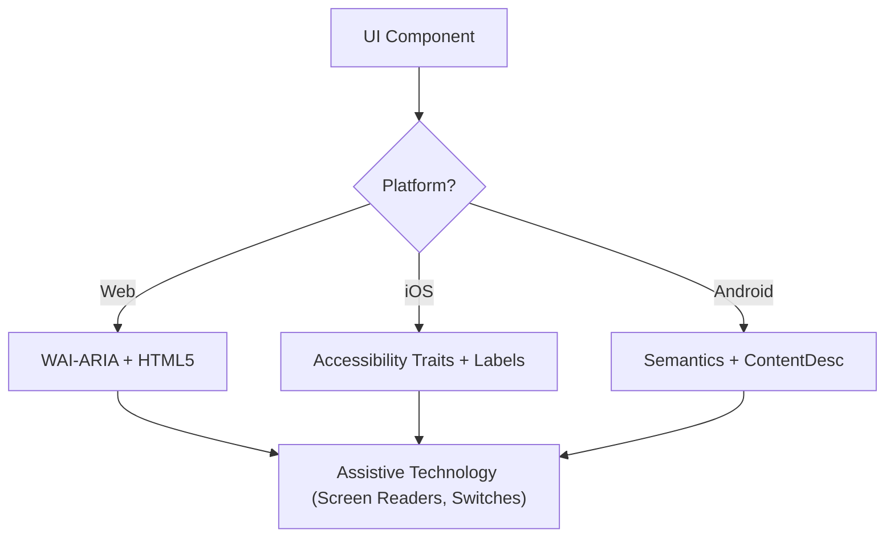

# アクセシビリティ (WCAG 2.2)

このスキルは、スクリーンリーダー・スイッチコントロール・キーボードナビゲーションを利用するユーザーを含むすべての利用者にとって、デジタルインターフェースが知覚可能・操作可能・理解可能・堅牢 (POUR) であることを保証するためのものである。WCAG 2.2 達成基準の技術的な実装に焦点を当てる。

## 利用するタイミング

- Web・iOS・Android 向け UI コンポーネント仕様の定義時。
- 既存コードのアクセシビリティバリアや遵守ギャップを監査する時。
- Target Size (Minimum) や Focus Appearance といった新しい WCAG 2.2 標準を実装する時。
- 高レベル設計要件を技術属性 (ARIA ロール・特性・ヒント) にマッピングする時。

## 中核となる概念

- **POUR 原則**: WCAG の基盤 (Perceivable・Operable・Understandable・Robust)。
- **セマンティックマッピング**: 汎用コンテナよりもネイティブ要素を使用して組み込みアクセシビリティを提供する。
- **アクセシビリティツリー**: 支援技術が実際に「読み取る」UI の表現。
- **フォーカス管理**: キーボード/スクリーンリーダーのカーソルの順序と可視性を制御する。
- **ラベルとヒント**: `aria-label`・`accessibilityLabel`・`contentDescription` を通じて文脈を提供する。

## 仕組み

### Step 1: コンポーネントのロールを特定する

機能的な目的を判断する (例: ボタンなのかリンクなのかタブなのか)。カスタムロールに頼る前に、最もセマンティックなネイティブ要素を使用する。

### Step 2: 知覚可能 (Perceivable) な属性を定義する

- テキストコントラストが **4.5:1** (通常) または **3:1** (大文字/UI) を満たすことを確認する。
- 非テキストコンテンツ (画像・アイコン) にテキスト代替を追加する。
- レスポンシブなリフロー (機能を失うことなく最大 400% ズーム) を実装する。

### Step 3: 操作可能 (Operable) なコントロールを実装する

- 最小 **24x24 CSS ピクセル** のターゲットサイズを確保する (WCAG 2.2 SC 2.5.8)。
- すべてのインタラクティブ要素がキーボードで到達可能であり、可視のフォーカスインジケーターを持つことを検証する (SC 2.4.11)。
- ドラッグ動作に対するシングルポインター代替手段を提供する。

### Step 4: 理解可能 (Understandable) なロジックを確保する

- 一貫したナビゲーションパターンを使用する。
- 修正のための説明的なエラーメッセージと提案を提供する (SC 3.3.3)。
- 同じデータを 2 度尋ねないように「Redundant Entry」(SC 3.3.7) を実装する。

### Step 5: 堅牢 (Robust) な互換性を検証する

- 正しい `Name, Role, Value` パターンを使用する。
- 動的なステータス更新のために `aria-live` またはライブリージョンを実装する。

## アクセシビリティアーキテクチャ図



## クロスプラットフォームマッピング

| 機能                 | Web (HTML/ARIA)          | iOS (SwiftUI)                        | Android (Compose)                                           |
| :----------------- | :----------------------- | :----------------------------------- | :---------------------------------------------------------- |
| **主ラベル**     | `aria-label` / `<label>` | `.accessibilityLabel()`              | `contentDescription`                                        |
| **副次ヒント**   | `aria-describedby`       | `.accessibilityHint()`               | `Modifier.semantics { stateDescription = ... }`             |
| **アクションロール** | `role="button"`          | `.accessibilityAddTraits(.isButton)` | `Modifier.semantics { role = Role.Button }`                 |
| **ライブ更新**   | `aria-live="polite"`     | `.accessibilityLiveRegion(.polite)`  | `Modifier.semantics { liveRegion = LiveRegionMode.Polite }` |

## 例

### Web: アクセシブルな検索

```html
<form role="search">
  <label for="search-input" class="sr-only">Search products</label>
  <input type="search" id="search-input" placeholder="Search..." />
  <button type="submit" aria-label="Submit Search">
    <svg aria-hidden="true">...</svg>
  </button>
</form>
```

### iOS: アクセシブルなアクションボタン

```swift
Button(action: deleteItem) {
    Image(systemName: "trash")
}
.accessibilityLabel("Delete item")
.accessibilityHint("Permanently removes this item from your list")
.accessibilityAddTraits(.isButton)
```

### Android: アクセシブルなトグル

```kotlin
Switch(
    checked = isEnabled,
    onCheckedChange = { onToggle() },
    modifier = Modifier.semantics {
        contentDescription = "Enable notifications"
    }
)
```

## 避けるべきアンチパターン

- **Div ボタン**: ロールとキーボードサポートを追加せずに `<div>` や `<span>` をクリックイベントに使用する。
- **色のみによる意味付け**: エラーやステータスを色の変更 _のみ_ で示す (例: ボーダーを赤に変える)。
- **コンテイナ化されていないモーダルフォーカス**: フォーカスをトラップしないモーダルにより、開いている間もキーボードユーザーが背景コンテンツへナビゲートできてしまう。フォーカスはコンテインされ、かつ `Escape` キーまたは明示的なクローズボタンでエスケープ可能でなければならない (WCAG SC 2.1.2)。
- **冗長な alt テキスト**: alt テキストで「画像: ...」「写真: ...」を使う (スクリーンリーダーは既にロール「画像」をアナウンスする)。

## ベストプラクティスチェックリスト

- [ ] インタラクティブ要素が **24x24px** (Web) または **44x44pt** (ネイティブ) のターゲットサイズを満たしている。
- [ ] フォーカスインジケーターが明確に見え、コントラストが高い。
- [ ] モーダルが開いている間 **フォーカスをコンテインし**、クローズ時 (`Escape` キーまたはクローズボタン) にクリーンに解放する。
- [ ] ドロップダウンとメニューがクローズ時にトリガー要素にフォーカスを復元する。
- [ ] フォームがテキストベースのエラー提案を提供する。
- [ ] アイコンのみのボタンすべてに説明的なテキストラベルがある。
- [ ] テキスト拡大時にコンテンツが適切にリフローする。

## 参考資料

- [WCAG 2.2 Guidelines](https://www.w3.org/TR/WCAG22/)
- [WAI-ARIA Authoring Practices](https://www.w3.org/TR/wai-aria-practices/)
- [iOS Accessibility Programming Guide](https://developer.apple.com/documentation/accessibility)
- [iOS Human Interface Guidelines - Accessibility](https://developer.apple.com/design/human-interface-guidelines/accessibility)
- [Android Accessibility Developer Guide](https://developer.android.com/guide/topics/ui/accessibility)

## 関連スキル

- `frontend-patterns`
- `design-system`
- `liquid-glass-design`
- `swiftui-patterns`
