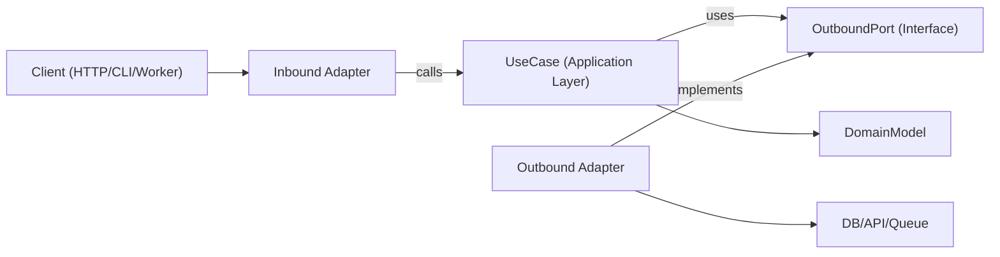

# ヘキサゴナルアーキテクチャ

ヘキサゴナルアーキテクチャ（Ports and Adapters）は、ビジネスロジックをフレームワーク・トランスポート・永続化詳細から独立させる。コアアプリは抽象ポートに依存し、アダプタが境界でそのポートを実装する。

## 利用タイミング

- 長期メンテナンス性とテスト可能性が重要な新機能構築
- ドメインロジックが I/O 関心事と混在する層化/フレームワーク重視コードのリファクタリング
- 同一ユースケースに複数インターフェース（HTTP、CLI、キューワーカー、cron）を提供する
- ビジネスルールを書き換えずインフラ（DB、外部 API、メッセージバス）を置き換える

境界、ドメイン中心設計、密結合サービスのリファクタリング、特定ライブラリからのアプリケーションロジック分離を扱う要求に用いる。

## 中核コンセプト

- **ドメインモデル**: ビジネスルールとエンティティ/値オブジェクト。フレームワーク import なし
- **ユースケース（アプリケーションレイヤ）**: ドメイン挙動とワークフローステップを協調させる
- **インバウンドポート**: アプリが何をできるか記述する契約（コマンド/クエリ/ユースケースインターフェース）
- **アウトバウンドポート**: アプリが必要とする依存の契約（リポジトリ、ゲートウェイ、イベントパブリッシャ、Clock、UUID 等）
- **アダプタ**: ポートのインフラ・配信実装（HTTP コントローラ、DB リポジトリ、キューコンシューマ、SDK ラッパー）
- **Composition root**: 具象アダプタをユースケースへバインドする単一配線箇所

アウトバウンドポートインターフェースは通常アプリケーションレイヤに置く（抽象が真にドメインレベルのときのみドメインに）。インフラアダプタがそれを実装する。

依存方向は常に内向き:

- アダプタ → アプリケーション/ドメイン
- アプリケーション → ポートインターフェース（インバウンド/アウトバウンド契約）
- ドメイン → ドメイン専用抽象（フレームワーク/インフラ依存なし）
- ドメイン → 外部依存なし

## 仕組み

### Step 1: ユースケース境界をモデル化する

明確な入出力 DTO を持つ単一ユースケースを定義する。トランスポート詳細（Express `req`、GraphQL `context`、ジョブペイロードラッパー）はこの境界外に置く。

### Step 2: アウトバウンドポートを先に定義する

各副作用をポートとして特定する:

- 永続化 (`UserRepositoryPort`)
- 外部呼び出し (`BillingGatewayPort`)
- 横断関心事 (`LoggerPort`、`ClockPort`)

ポートは技術ではなく能力をモデル化する。

### Step 3: 純粋オーケストレーションでユースケースを実装する

ユースケースクラス/関数はコンストラクタ/引数経由でポートを受け取る。アプリケーションレベル不変条件を検証し、ドメインルールを調整し、プレーンデータ構造を返す。

### Step 4: 境界でアダプタを構築する

- インバウンドアダプタはプロトコル入力をユースケース入力に変換する
- アウトバウンドアダプタはアプリ契約を具象 API/ORM/クエリビルダにマッピングする
- マッピングはユースケース内ではなくアダプタに留める

### Step 5: Composition root ですべてを配線する

アダプタを生成し、ユースケースへ注入する。隠れたサービスロケータ挙動を避けるため配線を集中化する。

### Step 6: 境界ごとにテストする

- ユースケースを fake ポートでユニットテストする
- 実インフラ依存でアダプタを統合テストする
- インバウンドアダプタ経由でユーザー向けフローを E2E テストする

## アーキテクチャ図



## 推奨モジュールレイアウト

明示的境界を持つ feature-first 構成を使う:

```text
src/
  features/
    orders/
      domain/
        Order.ts
        OrderPolicy.ts
      application/
        ports/
          inbound/
            CreateOrder.ts
          outbound/
            OrderRepositoryPort.ts
            PaymentGatewayPort.ts
        use-cases/
          CreateOrderUseCase.ts
      adapters/
        inbound/
          http/
            createOrderRoute.ts
        outbound/
          postgres/
            PostgresOrderRepository.ts
          stripe/
            StripePaymentGateway.ts
      composition/
        ordersContainer.ts
```

## TypeScript 例

### ポート定義

```typescript
export interface OrderRepositoryPort {
  save(order: Order): Promise<void>;
  findById(orderId: string): Promise<Order | null>;
}

export interface PaymentGatewayPort {
  authorize(input: { orderId: string; amountCents: number }): Promise<{ authorizationId: string }>;
}
```

### ユースケース

```typescript
type CreateOrderInput = {
  orderId: string;
  amountCents: number;
};

type CreateOrderOutput = {
  orderId: string;
  authorizationId: string;
};

export class CreateOrderUseCase {
  constructor(
    private readonly orderRepository: OrderRepositoryPort,
    private readonly paymentGateway: PaymentGatewayPort
  ) {}

  async execute(input: CreateOrderInput): Promise<CreateOrderOutput> {
    const order = Order.create({ id: input.orderId, amountCents: input.amountCents });

    const auth = await this.paymentGateway.authorize({
      orderId: order.id,
      amountCents: order.amountCents,
    });

    // markAuthorized returns a new Order instance; it does not mutate in place.
    const authorizedOrder = order.markAuthorized(auth.authorizationId);
    await this.orderRepository.save(authorizedOrder);

    return {
      orderId: order.id,
      authorizationId: auth.authorizationId,
    };
  }
}
```

### アウトバウンドアダプタ

```typescript
export class PostgresOrderRepository implements OrderRepositoryPort {
  constructor(private readonly db: SqlClient) {}

  async save(order: Order): Promise<void> {
    await this.db.query(
      "insert into orders (id, amount_cents, status, authorization_id) values ($1, $2, $3, $4)",
      [order.id, order.amountCents, order.status, order.authorizationId]
    );
  }

  async findById(orderId: string): Promise<Order | null> {
    const row = await this.db.oneOrNone("select * from orders where id = $1", [orderId]);
    return row ? Order.rehydrate(row) : null;
  }
}
```

### Composition root

```typescript
export const buildCreateOrderUseCase = (deps: { db: SqlClient; stripe: StripeClient }) => {
  const orderRepository = new PostgresOrderRepository(deps.db);
  const paymentGateway = new StripePaymentGateway(deps.stripe);

  return new CreateOrderUseCase(orderRepository, paymentGateway);
};
```

## 多言語マッピング

エコシステムをまたいで同じ境界ルールを使う。構文と配線スタイルだけが変わる。

- **TypeScript/JavaScript**
  - ポート: `application/ports/*` をインターフェース/型に
  - ユースケース: コンストラクタ/引数注入のクラス/関数
  - アダプタ: `adapters/inbound/*`、`adapters/outbound/*`
  - Composition: 明示的なファクトリ/コンテナモジュール（隠れたグローバルなし）
- **Java**
  - パッケージ: `domain`、`application.port.in`、`application.port.out`、`application.usecase`、`adapter.in`、`adapter.out`
  - ポート: `application.port.*` 内のインターフェース
  - ユースケース: プレーンクラス（Spring `@Service` はオプション、必須ではない）
  - Composition: Spring 設定または手動配線クラス。配線をドメイン/ユースケースクラスの外に保つ
- **Kotlin**
  - モジュール/パッケージは Java 分割をミラーする（`domain`、`application.port`、`application.usecase`、`adapter`）
  - ポート: Kotlin インターフェース
  - ユースケース: コンストラクタ注入のクラス（Koin/Dagger/Spring/手動）
  - Composition: モジュール定義または専用 composition 関数。サービスロケータパターンを避ける
- **Go**
  - パッケージ: `internal/<feature>/domain`、`application`、`ports`、`adapters/inbound`、`adapters/outbound`
  - ポート: 消費するアプリケーションパッケージが所有する小さなインターフェース
  - ユースケース: インターフェースフィールドと明示的 `New...` コンストラクタを持つ struct
  - Composition: `cmd/<app>/main.go`（または専用配線パッケージ）で wire。コンストラクタを明示的に保つ

## 避けるべきアンチパターン

- ドメインエンティティが ORM モデル・Web フレームワーク型・SDK クライアントを import する
- ユースケースが `req`、`res`、キューメタデータから直接読む
- ドメイン/アプリケーションマッピングなしにユースケースから DB 行を直接返す
- アダプタがユースケースポート経由ではなく互いを直接呼ぶ
- 多数のファイルに隠れたグローバルシングルトンを伴って依存配線を分散させる

## 移行プレイブック

1. 変更痛が頻発する単一の垂直スライス（単一エンドポイント/ジョブ）を選ぶ
2. 明示的入出力型でユースケース境界を抽出する
3. 既存インフラ呼び出し周りにアウトバウンドポートを導入する
4. コントローラ/サービスからユースケースへオーケストレーションロジックを移動する
5. 旧アダプタは保持するが、新ユースケースへ委譲させる
6. 新境界周辺にテストを追加する（unit + アダプタ統合）
7. スライス単位で繰り返す。完全書き換えを避ける

### 既存システムのリファクタリング

- **Strangler アプローチ**: 既存エンドポイントを保持し、ユースケース1つずつを新ポート/アダプタ経由でルーティングする
- **ビッグバン書き換え禁止**: 機能スライス単位で移行し、characterization テストで挙動を維持する
- **Facade ファースト**: 内部を置換する前にレガシーサービスをアウトバウンドポートでラップする
- **Composition フリーズ**: 配線を早期に集中化し、新規依存がドメイン/ユースケースレイヤに漏れないようにする
- **スライス選定ルール**: 高 churn・低 blast-radius フローを優先する
- **ロールバックパス**: 本番挙動が検証されるまで、移行済みスライスごとに可逆トグルやルート切替を保つ

## テストガイダンス（同じヘキサゴナル境界）

- **ドメインテスト**: エンティティ/値オブジェクトを純ビジネスルールとしてテスト（モックなし、フレームワークセットアップなし）
- **ユースケースユニットテスト**: アウトバウンドポートを fake/stub し、ビジネス結果とポート相互作用をアサートする
- **アウトバウンドアダプタ契約テスト**: ポートレベルで共有契約スイートを定義し、各アダプタ実装に対して実行する
- **インバウンドアダプタテスト**: プロトコルマッピング（HTTP/CLI/キューペイロードからユースケース入力へ、出力/エラーをプロトコルへ戻す）を検証する
- **アダプタ統合テスト**: 実インフラ（DB/API/キュー）に対しシリアライゼーション・スキーマ/クエリ挙動・リトライ・タイムアウトを実行する
- **E2E テスト**: インバウンドアダプタ → ユースケース → アウトバウンドアダプタ経由のクリティカルユーザー旅程をカバー
- **リファクタ安全性**: 抽出前に characterization テストを加え、新境界挙動が安定・同等になるまで残す

## ベストプラクティスチェックリスト

- ドメインとユースケースレイヤは内部型とポートのみを import する
- すべての外部依存をアウトバウンドポートで表現する
- バリデーションは境界で行う（インバウンドアダプタ + ユースケース不変条件）
- 不変変換を使う（共有状態をミューテートせず新値/エンティティを返す）
- エラーは境界をまたいで変換する（インフラエラー → アプリケーション/ドメインエラー）
- Composition root が明示的で監査しやすい
- ユースケースがポート向けの単純なインメモリ fake でテスト可能
- リファクタは挙動保持テスト付きの1垂直スライスから開始する
- 言語/フレームワーク固有事項はアダプタに留め、ドメインルールに持ち込まない
