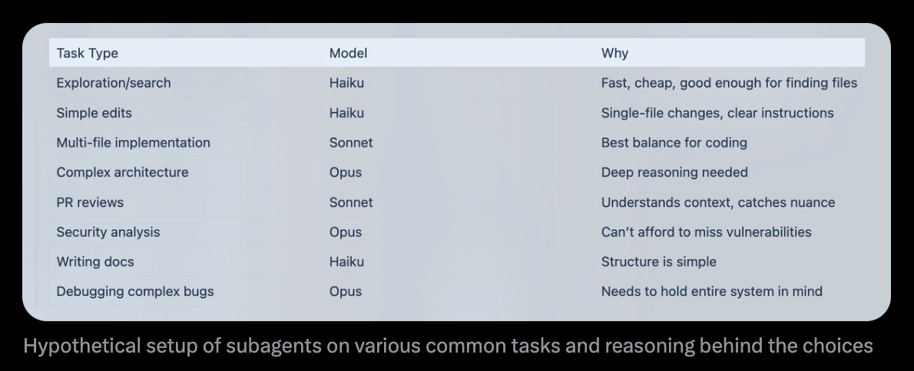
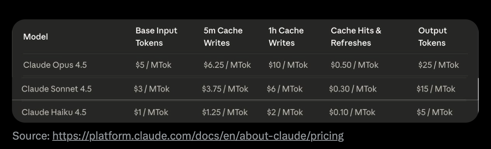

# Everything Claude Code 詳細ガイド


---

> **前提**: 本ガイドは [The Shorthand Guide to Everything Claude Code](./the-shortform-guide.md) の上に構築される。スキル、フック、サブエージェント、MCP、プラグインをセットアップしていない場合は先にそちらを読むこと。


*短縮ガイド - 最初に読むこと*

短縮ガイドでは基礎セットアップをカバーした: スキルとコマンド、フック、サブエージェント、MCP、プラグイン、効果的な Claude Code ワークフローのバックボーンを形成する設定パターン。それはセットアップガイドとベースインフラだった。

この詳細ガイドは、生産的なセッションを無駄なセッションから分離する技術に踏み込む。短縮ガイドを読んでいないなら、戻って設定を先にセットアップする。以降は既にスキル、エージェント、フック、MCP が設定され動作していることを前提とする。

ここでのテーマ: トークン経済、メモリ永続化、検証パターン、並列化戦略、再利用可能ワークフロー構築の複合効果。これらは 10 ヶ月以上の日常利用で洗練したパターンで、最初の 1 時間以内にコンテキスト腐敗に悩まされるか、何時間も生産的セッションを維持できるかの差を生む。

短縮版と詳細版のガイドでカバーされるすべては GitHub で利用可能: `github.com/affaan-m/everything-claude-code`

---

## ヒントとトリック

### 一部の MCP は置換可能でコンテキストウィンドウを解放する

バージョン管理 (GitHub)、データベース (Supabase)、デプロイ (Vercel、Railway) などの MCP — これらプラットフォームのほとんどは MCP が本質的にラップしているだけの堅牢な CLI を既に持つ。MCP は良いラッパーだがコストが伴う。

実際に MCP を使わずに (そして付随するコンテキストウィンドウ減少なしで) MCP のように CLI を機能させるには、機能をスキルとコマンドにバンドルすることを検討する。MCP が公開する便利ツールを抜き出し、それらをコマンドにする。

例: GitHub MCP を常時ロードする代わりに、優先オプション付きで `gh pr create` をラップする `/gh-pr` コマンドを作る。Supabase MCP がコンテキストを食う代わりに、Supabase CLI を直接使うスキルを作る。

遅延ロードでコンテキストウィンドウ問題はほぼ解決される。しかしトークン利用とコストは同じ方法では解決されない。CLI + スキルアプローチは依然トークン最適化方法である。

---

## 重要な事項

### コンテキストとメモリ管理

セッション間のメモリ共有では、進捗を要約しチェックインし、`.claude` フォルダの `.tmp` ファイルに保存しセッション終わりまで append し続けるスキルまたはコマンドが最良の賭けである。翌日それをコンテキストとして使い、中断した場所から続けられる。古いコンテキストを新しい作業に汚染しないようセッションごとに新ファイルを作る。


*セッションストレージの例 -> <https://github.com/affaan-m/everything-claude-code/tree/main/examples/sessions>*

Claude は現状を要約するファイルを作成する。それをレビューし、必要なら編集を求め、新規開始する。新会話には、ファイルパスを提供するだけ。コンテキスト制限に達して複雑作業を続ける必要があるとき特に有用。これらファイルは以下を含むべき:
- 動作したアプローチ (検証可能なエビデンス付き)
- 試行したが動作しなかったアプローチ
- 試行していないアプローチと残作業

**戦略的にコンテキストをクリア:**

プランが設定されコンテキストがクリアされたら (Claude Code のプランモードで現在デフォルトオプション)、プランから作業できる。実行にもはや関連しない多くの探索コンテキストを蓄積したときに有用。戦略的 compact のため、auto compact を無効化する。論理的間隔で手動 compact するか、それを行うスキルを作る。

**高度: 動的システムプロンプト注入**

私が拾ったパターン: 毎セッションロードされる CLAUDE.md (ユーザースコープ) または `.claude/rules/` (プロジェクトスコープ) にすべてを置く代わりに、CLI フラグを使ってコンテキストを動的に注入する。

```bash
claude --system-prompt "$(cat memory.md)"
```

これにより、どのコンテキストがいつロードされるかをよりサージカルにできる。システムプロンプトコンテンツはユーザーメッセージより高い権威を持ち、ユーザーメッセージはツール結果より高い権威を持つ。

**実用セットアップ:**

```bash
# Daily development
alias claude-dev='claude --system-prompt "$(cat ~/.claude/contexts/dev.md)"'

# PR review mode
alias claude-review='claude --system-prompt "$(cat ~/.claude/contexts/review.md)"'

# Research/exploration mode
alias claude-research='claude --system-prompt "$(cat ~/.claude/contexts/research.md)"'
```

**高度: メモリ永続化フック**

ほとんどの人が知らないメモリに役立つフックがある:

- **PreCompact フック**: コンテキスト compaction の前に重要状態をファイルに保存
- **Stop フック (セッション終わり)**: セッション終了時、学習をファイルに永続化
- **SessionStart フック**: 新セッション時、以前のコンテキストを自動ロード

これらフックを構築済みで、リポジトリの `github.com/affaan-m/everything-claude-code/tree/main/hooks/memory-persistence` にある

---

### 継続学習 / メモリ

複数回プロンプトを繰り返さなければならず Claude が同じ問題に遭遇したか以前聞いたレスポンスを返した — それらパターンはスキルに append されなければならない。

**問題:** 無駄なトークン、無駄なコンテキスト、無駄な時間。

**解決策:** Claude Code が非自明なもの — デバッグ技術、ワークアラウンド、プロジェクト固有パターン — を発見したとき、その知識を新スキルとして保存する。次回類似問題が浮上したらスキルが自動ロードされる。

これを行う継続学習スキルを構築済み: `github.com/affaan-m/everything-claude-code/tree/main/skills/continuous-learning`

**なぜ Stop フック (UserPromptSubmit でなく):**

重要な設計判断は、UserPromptSubmit の代わりに **Stop フック** を使うこと。UserPromptSubmit は各メッセージで実行される — 各プロンプトにレイテンシを追加する。Stop はセッション終了時に 1 回実行される — 軽量で、セッション中に遅くしない。

---

### トークン最適化

**主戦略: サブエージェントアーキテクチャ**

使うツールと、タスクに十分な最も安価モデルを委任するよう設計されたサブエージェントアーキテクチャを最適化する。

**モデル選択クイックリファレンス:**


*各種共通タスクでのサブエージェントの仮想セットアップと選択理由*

| タスク種別                | モデル | 理由                                       |
| ------------------------- | ------ | ------------------------------------------ |
| 探索/検索                 | Haiku  | 高速、安価、ファイル発見に十分             |
| 単純編集                  | Haiku  | 単一ファイル変更、明確な指示               |
| マルチファイル実装        | Sonnet | コーディングに最良のバランス               |
| 複雑なアーキテクチャ      | Opus   | 深い推論が必要                             |
| PR レビュー               | Sonnet | コンテキストを理解、ニュアンスを捉える     |
| セキュリティ分析          | Opus   | 脆弱性を見逃せない                         |
| ドキュメント書き          | Haiku  | 構造が単純                                 |
| 複雑バグデバッグ          | Opus   | システム全体を頭に保つ必要がある           |

90% のコーディングタスクに Sonnet をデフォルトとする。最初の試みが失敗、タスクが 5+ ファイルにまたがる、アーキテクチャ判断、またはセキュリティクリティカルコードのときに Opus にアップグレード。

**価格リファレンス:**


*ソース: <https://platform.claude.com/docs/en/about-claude/pricing>*

**ツール固有最適化:**

grep を mgrep に置換する - 伝統的 grep や ripgrep に比べて平均 ~50% トークン削減:


*50 タスクのベンチマークで、mgrep + Claude Code は同等またはより良い判定品質で、grep ベースワークフローより ~2 倍少ないトークンを使った。ソース: @mixedbread-ai による mgrep*

**モジュラーコードベースの利点:**

メインファイルが数千行ではなく数百行になるよりモジュラーなコードベースは、トークン最適化コストとタスクを初回で正しく完了する両方で助けになる。

---

### 検証ループと eval

**ベンチマークワークフロー:**

スキルあり/なしで同じことを問い出力差をチェックすることで比較する:

会話を fork し、片方でスキル無しの新 worktree を初期化し、最後に diff を表示し、何がログされたか見る。

**Eval パターン種別:**

- **チェックポイントベース eval**: 明示的チェックポイントを設定、定義済み基準に対して検証、進行前に修正
- **継続 eval**: N 分ごとまたは主要変更後に実行、フルテストスイート + lint

**主要メトリクス:**

```
pass@k: k 試行の少なくとも 1 つが成功
        k=1: 70%  k=3: 91%  k=5: 97%

pass^k: すべての k 試行が成功しなければならない
        k=1: 70%  k=3: 34%  k=5: 17%
```

動作する必要があるだけなら **pass@k** を使う。一貫性が本質的なら **pass^k** を使う。

---

## 並列化

マルチ Claude ターミナルセットアップで会話を fork する際、fork と元会話のアクションのスコープが十分定義されていることを確認する。コード変更に関しては最小重複を目指す。

**私の優先パターン:**

メインチャットはコード変更用、fork はコードベースとその現状に関する質問または外部サービスの調査用。

**任意ターミナル数について:**


*複数 Claude インスタンス実行に関する Boris (Anthropic)*

Boris は並列化のヒントを持つ。ローカルで 5 Claude インスタンスとアップストリームで 5 のような提案をしている。私は任意のターミナル数を設定することに対して助言する。ターミナルの追加は真の必要性から出るべき。

目標は: **並列化の最小実行可能量でどれだけ片付けられるか** であるべき。

**並列インスタンス用 Git Worktree:**

```bash
# Create worktrees for parallel work
git worktree add ../project-feature-a feature-a
git worktree add ../project-feature-b feature-b
git worktree add ../project-refactor refactor-branch

# Each worktree gets its own Claude instance
cd ../project-feature-a && claude
```

インスタンスをスケールし始め、互いに重複するコードに作業する複数 Claude インスタンスがあるなら、git worktree を使い、各々に非常に定義されたプランを持つことが必須。`/rename <name here>` ですべてのチャットに名前を付ける。


*開始セットアップ: 左ターミナルでコーディング、右ターミナルで質問 - /rename と /fork を使う*

**カスケード手法:**

複数 Claude Code インスタンスを実行する際、「カスケード」パターンで整理する:

- 新タスクを右に新タブで開く
- 古いものから新しいものへ左から右にスウィープ
- 一度に最大 3-4 タスクにフォーカス

---

## 下準備

**2 インスタンスキックオフパターン:**

私自身のワークフロー管理では、2 つの開いた Claude インスタンスで空リポジトリを始めるのが好き。

**Instance 1: 足場エージェント**
- 足場と基礎を敷く
- プロジェクト構造を作成
- 設定 (CLAUDE.md、ルール、エージェント) をセットアップ

**Instance 2: 深い調査エージェント**
- すべてのサービス、Web 検索に接続
- 詳細な PRD を作成
- アーキテクチャ mermaid ダイアグラムを作成
- 実際のドキュメントクリップでリファレンスをコンパイル

**llms.txt パターン:**

利用可能なら、ドキュメントページに到達した後に `/llms.txt` を実行することで、多くのドキュメントリファレンスで `llms.txt` を見つけられる。これによりドキュメントのクリーンで LLM 最適化されたバージョンが得られる。

**哲学: 再利用可能パターンを構築する**

@omarsar0 から: 「早期に再利用可能ワークフロー/パターンの構築に時間を費やした。構築は退屈だったが、モデルとエージェントハーネスが改善するにつれ、これは野生の複合効果を持った。」

**投資すべきもの:**

- サブエージェント
- スキル
- コマンド
- 計画パターン
- MCP ツール
- コンテキストエンジニアリングパターン

---

## エージェント・サブエージェントのベストプラクティス

**サブエージェントコンテキスト問題:**

サブエージェントはすべてをダンプする代わりにサマリを返すことでコンテキストを節約するために存在する。しかしオーケストレータはサブエージェントが持たない意味コンテキストを持つ。サブエージェントはリテラルクエリのみを知り、リクエストの背後にある目的は知らない。

**反復取得パターン:**

1. オーケストレータがすべてのサブエージェント返却を評価する
2. 受理前にフォローアップ質問する
3. サブエージェントがソースに戻り、回答を得て、返す
4. 十分まで反復 (最大 3 サイクル)

**鍵:** クエリだけでなく目的コンテキストを渡す。

**順次フェーズ付きオーケストレータ:**

```markdown
Phase 1: RESEARCH (use Explore agent) → research-summary.md
Phase 2: PLAN (use planner agent) → plan.md
Phase 3: IMPLEMENT (use tdd-guide agent) → code changes
Phase 4: REVIEW (use code-reviewer agent) → review-comments.md
Phase 5: VERIFY (use build-error-resolver if needed) → done or loop back
```

**主要ルール:**

1. 各エージェントは 1 つの明確な入力を得て 1 つの明確な出力を生成する
2. 出力は次フェーズの入力になる
3. フェーズを決してスキップしない
4. エージェント間で `/clear` を使う
5. 中間出力をファイルに保存する

---

## 楽しい事項 / クリティカルではない楽しいヒント

### カスタムステータスライン

`/statusline` を使って設定できる — そして Claude はあなたが持っていないが彼があなたのためにセットアップでき、何を含めたいか問う、と言う。

参照: ccstatusline (カスタム Claude Code ステータスライン用コミュニティプロジェクト)

### 音声トランスクリプション

声で Claude Code に話す。多くの人にとってタイプより速い。

- Mac で superwhisper、MacWhisper
- トランスクリプションミスがあっても Claude は意図を理解する

### ターミナルエイリアス

```bash
alias c='claude'
alias gb='github'
alias co='code'
alias q='cd ~/Desktop/projects'
```

---

## マイルストーン


*1 週間未満で 25,000+ GitHub スター*

---

## リソース

**エージェントオーケストレーション:**

- claude-flow — 54+ 専門エージェント付きコミュニティ構築エンタープライズオーケストレーションプラットフォーム

**自己改善メモリ:**

- 本リポジトリの `skills/continuous-learning/` を参照
- rlancemartin.github.io/2025/12/01/claude_diary/ - セッションリフレクションパターン

**システムプロンプトリファレンス:**

- system-prompts-and-models-of-ai-tools — AI システムプロンプトのコミュニティコレクション (110k+ スター)

**公式:**

- Anthropic Academy: anthropic.skilljar.com

---

## リファレンス

- [Anthropic: Demystifying evals for AI agents](https://www.anthropic.com/engineering/demystifying-evals-for-ai-agents)
- [YK: 32 Claude Code Tips](https://agenticcoding.substack.com/p/32-claude-code-tips-from-basics-to)
- [RLanceMartin: Session Reflection Pattern](https://rlancemartin.github.io/2025/12/01/claude_diary/)
- @PerceptualPeak: Sub-Agent Context Negotiation
- @menhguin: Agent Abstractions Tierlist
- @omarsar0: Compound Effects Philosophy

---

*両ガイドでカバーされるすべては GitHub の [everything-claude-code](https://github.com/affaan-m/everything-claude-code) で利用可能*
