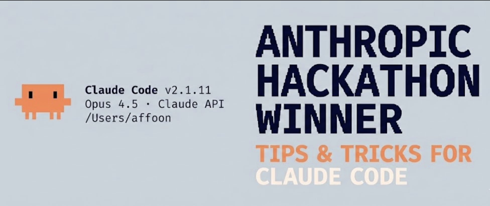

# Everything Claude Code 短縮ガイド



---

**2 月の実験的ロールアウト以来、熱心な Claude Code ユーザーであり、[@DRodriguezFX](https://x.com/DRodriguezFX) と共に [zenith.chat](https://zenith.chat) で Anthropic x Forum Ventures ハッカソンを優勝した — 完全に Claude Code を使って。**

10 ヶ月の日常利用後の完全なセットアップ: スキル、フック、サブエージェント、MCP、プラグイン、そして実際に動くもの。

---

## スキルとコマンド

スキルは主要ワークフローサーフェスである。スコープ化されたワークフローバンドルのように動作する: 再利用可能なプロンプト、構造、サポートファイル、特定の実行パターンが必要なときのコードマップ。

Opus 4.5 でのコーディングの長いセッション後、デッドコードと緩い .md ファイルをクリーンアウトしたい? `/refactor-clean` を実行する。テストが必要? `/tdd`、`/e2e`、`/test-coverage`。それらスラッシュエントリは便利だが、本当の永続ユニットは基底のスキルである。スキルはコードマップも含めることができる — Claude が探索でコンテキストを焼かずにコードベースをすばやくナビゲートする方法。


*コマンドを連鎖させる*

ECC は依然 `commands/` レイヤを出荷するが、これはマイグレーション中のレガシースラッシュエントリ互換として考えるのが最適である。永続ロジックはスキルに存在すべきである。

- **Skills**: `~/.claude/skills/` - canonical なワークフロー定義
- **Commands**: `~/.claude/commands/` - 依然必要なときのレガシースラッシュエントリ shim

```bash
# Example skill structure
~/.claude/skills/
  pmx-guidelines.md      # Project-specific patterns
  coding-standards.md    # Language best practices
  tdd-workflow/          # Multi-file skill with SKILL.md
  security-review/       # Checklist-based skill
```

---

## フック

フックは特定イベントで発火するトリガベース自動化である。スキルと異なり、ツールコールとライフサイクルイベントに制約される。

**フック種別:**

1. **PreToolUse** - ツール実行前 (検証、リマインダ)
2. **PostToolUse** - ツール終了後 (フォーマット、フィードバックループ)
3. **UserPromptSubmit** - メッセージ送信時
4. **Stop** - Claude が応答完了時
5. **PreCompact** - コンテキスト compaction 前
6. **Notification** - 権限要求

**例: 長時間コマンド前の tmux リマインダ**

```json
{
  "PreToolUse": [
    {
      "matcher": "tool == \"Bash\" && tool_input.command matches \"(npm|pnpm|yarn|cargo|pytest)\"",
      "hooks": [
        {
          "type": "command",
          "command": "if [ -z \"$TMUX\" ]; then echo '[Hook] Consider tmux for session persistence' >&2; fi"
        }
      ]
    }
  ]
}
```


*PostToolUse フック実行中に Claude Code で得られるフィードバックの例*

**プロのヒント:** JSON を手動で書く代わりに、`hookify` プラグインを使ってフックを会話的に作成する。`/hookify` を実行して欲しいものを記述する。

---

## サブエージェント

サブエージェントはオーケストレータ (メイン Claude) が限定スコープでタスクを委任できるプロセスである。バックグラウンドまたはフォアグラウンドで実行でき、メインエージェントのコンテキストを解放する。

サブエージェントはスキルとうまく動作する — スキルのサブセットを実行可能なサブエージェントはタスクを委任され、それらスキルを自律的に使える。特定のツール権限でサンドボックスもできる。

```bash
# Example subagent structure
~/.claude/agents/
  planner.md           # Feature implementation planning
  architect.md         # System design decisions
  tdd-guide.md         # Test-driven development
  code-reviewer.md     # Quality/security review
  security-reviewer.md # Vulnerability analysis
  build-error-resolver.md
  e2e-runner.md
  refactor-cleaner.md
```

適切なスコーピングのため、サブエージェントごとに許可ツール、MCP、権限を設定する。

---

## ルールとメモリ

`.rules` フォルダは Claude が常に従うべきベストプラクティスの `.md` ファイルを保持する。2 つのアプローチ:

1. **単一 CLAUDE.md** - すべてを 1 ファイルに (ユーザーまたはプロジェクトレベル)
2. **ルールフォルダ** - 関心事でグループ化されたモジュラー `.md` ファイル

```bash
~/.claude/rules/
  security.md      # No hardcoded secrets, validate inputs
  coding-style.md  # Immutability, file organization
  testing.md       # TDD workflow, 80% coverage
  git-workflow.md  # Commit format, PR process
  agents.md        # When to delegate to subagents
  performance.md   # Model selection, context management
```

**ルール例:**

- コードベースで絵文字なし
- フロントエンドで紫色を避ける
- デプロイ前に常にコードをテスト
- メガファイルよりモジュラーコードを優先
- console.log を絶対にコミットしない

---

## MCP (Model Context Protocol)

MCP は Claude を外部サービスに直接接続する。API の置き換えではない — その周辺のプロンプト駆動ラッパーであり、情報のナビゲーションにより柔軟性を許す。

**例:** Supabase MCP は Claude に特定データを引き、コピペ無しに SQL を直接アップストリームで実行させる。データベース、デプロイプラットフォームなどでも同様。


*Supabase MCP が public スキーマ内のテーブルをリストする例*

**Chrome in Claude:** Claude にブラウザを自律的に制御させる組み込みプラグイン MCP — クリック回って動作を見る。

**CRITICAL: コンテキストウィンドウ管理**

MCP に厳選的になる。すべての MCP をユーザー設定に保つが、**未使用のすべてを無効化** する。`/plugins` にナビゲートしてスクロールダウンまたは `/mcp` を実行。


*/plugins を使って現在インストールされている MCP とそのステータスを見るためにナビゲート*

compaction 前の 200k コンテキストウィンドウは、有効化ツールが多すぎると 70k のみかもしれない。パフォーマンスが大幅に低下する。

**経験則:** 設定に 20-30 の MCP を持つが、10 以下の有効化 / 80 以下のアクティブツールに保つ。

```bash
# Check enabled MCPs
/mcp

# Disable unused ones in ~/.claude/settings.json or in the current repo's .mcp.json
```

---

## プラグイン

プラグインは退屈な手動セットアップの代わりに、容易インストールのためにツールをパッケージ化する。プラグインはスキル + MCP の組み合わせ、またはフック/ツールの束ねでありうる。

**プラグインのインストール:**

```bash
# Add a marketplace
# mgrep plugin by @mixedbread-ai
claude plugin marketplace add https://github.com/mixedbread-ai/mgrep

# Open Claude, run /plugins, find new marketplace, install from there
```


*新規インストールされた Mixedbread-Grep マーケットプレースを表示*

**LSP プラグイン** はエディタ外で Claude Code を頻繁に実行する場合に特に有用。Language Server Protocol はリアルタイム型チェック、go-to-definition、IDE を開かずにインテリジェント補完を Claude に与える。

```bash
# Enabled plugins example
typescript-lsp@claude-plugins-official  # TypeScript intelligence
pyright-lsp@claude-plugins-official     # Python type checking
hookify@claude-plugins-official         # Create hooks conversationally
mgrep@Mixedbread-Grep                   # Better search than ripgrep
```

MCP と同じ警告 — コンテキストウィンドウに注意。

---

## ヒントとトリック

### キーボードショートカット

- `Ctrl+U` - 行全体を削除 (バックスペース連打より速い)
- `!` - クイック bash コマンドプレフィクス
- `@` - ファイル検索
- `/` - スラッシュコマンド開始
- `Shift+Enter` - 複数行入力
- `Tab` - 思考表示切替
- `Esc Esc` - Claude を中断 / コード復元

### 並列ワークフロー

- **Fork** (`/fork`) - キューイングメッセージを spam する代わりに、非重複タスクを並列に行うため会話を fork
- **Git Worktree** - 重複する並列 Claude をコンフリクト無しで。各 worktree は独立したチェックアウト

```bash
git worktree add ../feature-branch feature-branch
# Now run separate Claude instances in each worktree
```

### 長時間コマンド用 tmux

Claude が実行するログ/bash プロセスをストリームして見る:

<https://github.com/user-attachments/assets/shortform/07-tmux-video.mp4>

```bash
tmux new -s dev
# Claude runs commands here, you can detach and reattach
tmux attach -t dev
```

### mgrep > grep

`mgrep` は ripgrep/grep からの有意な改善。プラグインマーケットプレース経由でインストールし、`/mgrep` スキルを使う。ローカル検索と Web 検索の両方で動作する。

```bash
mgrep "function handleSubmit"  # Local search
mgrep --web "Next.js 15 app router changes"  # Web search
```

### その他の有用コマンド

- `/rewind` - 以前の状態に戻る
- `/statusline` - ブランチ、コンテキスト %、todo でカスタマイズ
- `/checkpoints` - ファイルレベル undo ポイント
- `/compact` - コンテキスト compaction を手動トリガ

### GitHub Actions CI/CD

GitHub Actions で PR にコードレビューをセットアップ。設定すると Claude は PR を自動レビューできる。


*Claude がバグ修正 PR を承認*

### サンドボックス化

リスキーな操作にはサンドボックスモードを使う — Claude は実際のシステムに影響を与えない制限環境で実行される。

---

## エディタについて

エディタの選択は Claude Code ワークフローに有意に影響する。Claude Code は任意のターミナルから動作するが、能力あるエディタとペアにすると、リアルタイムファイル追跡、クイックナビゲーション、統合コマンド実行が解放される。

### Zed (私の好み)

私は [Zed](https://zed.dev) を使う — Rust で書かれており、本当に高速。即座に開き、巨大コードベースを汗をかかずに処理し、システムリソースをほぼ触らない。

**なぜ Zed + Claude Code が素晴らしい組み合わせか:**

- **速度** - Rust ベースパフォーマンスは Claude が急速にファイル編集するときラグ無しを意味する。エディタが追いつく
- **エージェントパネル統合** - Zed の Claude 統合は Claude が編集するときリアルタイムでファイル変更を追跡させる。エディタを離れずに Claude が参照するファイル間をジャンプ
- **CMD+Shift+R コマンドパレット** - すべてのカスタムスラッシュコマンド、デバッガ、ビルドスクリプトに検索可能 UI で迅速アクセス
- **最小リソース利用** - 重い操作中に RAM/CPU で Claude と競合しない。Opus 実行時に重要
- **Vim モード** - もしそれが好みならフル vim キーバインディング


*CMD+Shift+R によるカスタムコマンドドロップダウン付き Zed Editor。Following モードは右下のブルズアイとして表示。*

**エディタ非依存のヒント:**

1. **画面を分割** - 一方に Claude Code 付きターミナル、他方にエディタ
2. **Ctrl + G** - Zed で Claude が現在作業しているファイルをすばやく開く
3. **自動保存** - 自動保存を有効化し Claude のファイル読み取りが常に現在になるようにする
4. **Git 統合** - コミット前に Claude の変更をレビューするためエディタの git 機能を使う
5. **ファイル監視** - 多くのエディタは変更ファイルを自動リロードする。これが有効化されていることを確認する

### VSCode / Cursor

これも実行可能な選択で Claude Code と上手く動作する。`\ide` で LSP 機能を有効化するエディタとの自動同期付きターミナル形式で使える (現在プラグインで多少冗長)。または、エディタとより統合され同じ UI を持つ拡張を選べる。


*VS Code 拡張は IDE に直接統合された Claude Code のネイティブグラフィカルインターフェースを提供する。*

---

## 私のセットアップ

### プラグイン

**インストール済み:** (通常一度に 4-5 のみ有効化)

```markdown
ralph-wiggum@claude-code-plugins       # Loop automation
frontend-patterns@claude-code-plugins  # UI/UX patterns
commit-commands@claude-code-plugins    # Git workflow
security-guidance@claude-code-plugins  # Security checks
pr-review-toolkit@claude-code-plugins  # PR automation
typescript-lsp@claude-plugins-official # TS intelligence
hookify@claude-plugins-official        # Hook creation
code-simplifier@claude-plugins-official
feature-dev@claude-code-plugins
explanatory-output-style@claude-code-plugins
code-review@claude-code-plugins
context7@claude-plugins-official       # Live documentation
pyright-lsp@claude-plugins-official    # Python types
mgrep@Mixedbread-Grep                  # Better search
```

### MCP サーバー

**設定済み (ユーザーレベル):**

```json
{
  "github": { "command": "npx", "args": ["-y", "@modelcontextprotocol/server-github"] },
  "firecrawl": { "command": "npx", "args": ["-y", "firecrawl-mcp"] },
  "supabase": {
    "command": "npx",
    "args": ["-y", "@supabase/mcp-server-supabase@latest", "--project-ref=YOUR_REF"]
  },
  "memory": { "command": "npx", "args": ["-y", "@modelcontextprotocol/server-memory"] },
  "sequential-thinking": {
    "command": "npx",
    "args": ["-y", "@modelcontextprotocol/server-sequential-thinking"]
  },
  "vercel": { "type": "http", "url": "https://mcp.vercel.com" },
  "railway": { "command": "npx", "args": ["-y", "@railway/mcp-server"] },
  "cloudflare-docs": { "type": "http", "url": "https://docs.mcp.cloudflare.com/mcp" },
  "cloudflare-workers-bindings": {
    "type": "http",
    "url": "https://bindings.mcp.cloudflare.com/mcp"
  },
  "clickhouse": { "type": "http", "url": "https://mcp.clickhouse.cloud/mcp" },
  "AbletonMCP": { "command": "uvx", "args": ["ableton-mcp"] },
  "magic": { "command": "npx", "args": ["-y", "@magicuidesign/mcp@latest"] }
}
```

これが鍵 — 14 の MCP を設定しているが、プロジェクトごとに ~5-6 のみ有効化。コンテキストウィンドウを健全に保つ。

### 主要フック

```json
{
  "PreToolUse": [
    { "matcher": "npm|pnpm|yarn|cargo|pytest", "hooks": ["tmux reminder"] },
    { "matcher": "Write && .md file", "hooks": ["block unless README/CLAUDE"] },
    { "matcher": "git push", "hooks": ["open editor for review"] }
  ],
  "PostToolUse": [
    { "matcher": "Edit && .ts/.tsx/.js/.jsx", "hooks": ["prettier --write"] },
    { "matcher": "Edit && .ts/.tsx", "hooks": ["tsc --noEmit"] },
    { "matcher": "Edit", "hooks": ["grep console.log warning"] }
  ],
  "Stop": [
    { "matcher": "*", "hooks": ["check modified files for console.log"] }
  ]
}
```

### カスタムステータスライン

ユーザー、ディレクトリ、dirty インジケータ付き git ブランチ、コンテキスト残 %、モデル、時刻、todo カウントを表示:


*Mac ルートディレクトリでの私のステータスラインの例*

```
affoon:~ ctx:65% Opus 4.5 19:52
▌▌ plan mode on (shift+tab to cycle)
```

### ルール構造

```
~/.claude/rules/
  security.md      # Mandatory security checks
  coding-style.md  # Immutability, file size limits
  testing.md       # TDD, 80% coverage
  git-workflow.md  # Conventional commits
  agents.md        # Subagent delegation rules
  patterns.md      # API response formats
  performance.md   # Model selection (Haiku vs Sonnet vs Opus)
  hooks.md         # Hook documentation
```

### サブエージェント

```
~/.claude/agents/
  planner.md           # Break down features
  architect.md         # System design
  tdd-guide.md         # Write tests first
  code-reviewer.md     # Quality review
  security-reviewer.md # Vulnerability scan
  build-error-resolver.md
  e2e-runner.md        # Playwright tests
  refactor-cleaner.md  # Dead code removal
  doc-updater.md       # Keep docs synced
```

---

## 主要な要点

1. **複雑にしすぎない** - 設定をアーキテクチャではなくファインチューニングのように扱う
2. **コンテキストウィンドウは貴重** - 未使用 MCP とプラグインを無効化する
3. **並列実行** - 会話を fork、git worktree を使う
4. **繰り返しを自動化** - フォーマット、lint、リマインダ用のフック
5. **サブエージェントをスコープ化** - 限定ツール = フォーカス実行

---

## リファレンス

- [Plugins Reference](https://code.claude.com/docs/en/plugins-reference)
- [Hooks Documentation](https://code.claude.com/docs/en/hooks)
- [Checkpointing](https://code.claude.com/docs/en/checkpointing)
- [Interactive Mode](https://code.claude.com/docs/en/interactive-mode)
- [Memory System](https://code.claude.com/docs/en/memory)
- [Subagents](https://code.claude.com/docs/en/sub-agents)
- [MCP Overview](https://code.claude.com/docs/en/mcp-overview)

---

**注:** これは詳細のサブセットである。高度なパターンは [Longform Guide](./the-longform-guide.md) を参照。

---

*[zenith.chat](https://zenith.chat) を [@DRodriguezFX](https://x.com/DRodriguezFX) と共に NYC で構築し、Anthropic x Forum Ventures ハッカソンを優勝*
